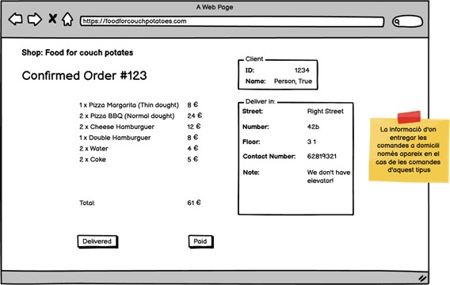

# S2.3-Data Structure (MongoDB)

This repository contains the design of different NoSQL (MongoDB) database models for various business scenarios, including an optics shop, a pizzeria, and a video platform.

## 📋 Deliverables

For each level, the following must be submitted:

* **Diagram:** A data model diagram (NoSQL-style ERD) created with tools like **Draw.io** or **Moon Modeler**.
* **Data Files:** `js` or `json` files containing the collection definitions and sample data to verify the design and relationships.

### 💡 A Note on the Design Approach (Denormalization)

The final JSON data structures provided for these exercises (especially for the Optics and Pizzeria) have been designed following a **denormalized** model.

This was a specific design choice to directly address the requirements implied by the **graphical interface (GUI) mockups** provided in the prompts.

Instead of using a normalized (SQL-like) approach with multiple collections and relational lookups (references), this design **embeds** all necessary information into a single document.

* **For the Optics Shop:** The UI mockups for the client view and the glasses view required embedding purchase data directly to avoid complex queries.
* **For the Pizzeria:** The "Confirmed Order" UI required creating a **snapshot** of all order data (client info, product details, and delivery address) within the `order` document itself.

This "refactored" approach ensures that all data needed to render a specific view can be fetched with a single, efficient query, fulfilling the non-relational goal of the exercise.

---

## Level 1

### Optic 👓

An optics shop, named “Cul d'Ampolla”, wants to computerize the management of its clients and glasses sales.

* First, the shop wants to know the **supplier** for each pair of glasses. Specifically, for each supplier, they want to know:
	* Name.
	* Address (street, number, floor, door, city, postal code, and country).
	* Phone, fax, NIF (Tax ID).

* For the **glasses**, they want to know:
	* Brand.
	* The prescription (graduation) of each lens.
	* The frame type (floating, acetate, or metallic).
	* The frame color.
	* The color of each lens.
	* The price.

* For the **clients**, they want to store:
	* Name.
	* Postal address.
	* Phone.
	* Email.
	* Registration date.
	* When a new client arrives, store the **client who recommended** them (if anyone recommended them).

* Our system must indicate which **employee** sold each pair of glasses. It must also define the **date/time the sale** occurs.

---

#### Exercise 1

Imagine we have the following graphical interface, from the point of view of an Optics client. How would you design the database to facilitate this information?

*(Note: This refers to the interface showing the client's data and their "Last Shoppings" history).*

#### Exercise 2

And if the interface's point of view was the glasses?

*(Note: This refers to the interface showing a specific pair of glasses' details and the "Bought By" list of clients).*

---

## Level 2

### Exercise 1: Pizzeria 🍕

You have been hired to design a website that allows for online food delivery orders.
Keep the following instructions in mind for modeling the project's database:

* For each **client**, we store a unique identifier: Name, surnames, address, postal code, locality, province, phone number.

* A person can place many **orders**, but a single order can only be placed by one person. For each order, a unique identifier is stored: Date/time of placement, if the order is for home delivery or store pickup, the quantity of products selected of each type, the total price, plus a note with additional information.

* An order can consist of one or more **products**.

* Products can be **pizzas**, **hamburgers**, and **drinks**. For each product, a unique identifier is stored: Name, description, image, price. In the case of pizzas, there are various **categories** that can change names throughout the year.

* An order is managed by a single **store**, and a store can manage many orders. For each store, a unique identifier is stored: Address, postal code, locality, province.

* Many **employees** can work in one store, but an employee can only work in one store. For each employee, a unique identifier is stored: Name, surnames, NIF, Phone, whether they work as a **cook** or **delivery driver**.

* For home delivery orders, it is necessary to save which **delivery driver** is handling the delivery and the date/time of the delivery.

### 🍕 "resources" Folder

Please note that for the Pizzeria exercise, a `resources` folder is included in the project directory.

This folder contains initial setup data, diagrams, or preliminary normalized models used during the initial analysis. **This data is for context only and is not the final answer to the exercise.**

The official solution is the final, denormalized JSON document designed to power the "Confirmed Order" interface.

---

## Level 3

### Exercise 1: YouTube 🎥

We will try to make a simple model of what the database for a reduced version of YouTube would look like.

* For each **user**, we save a unique identifier: Email, password, username, date of birth, sex, country, postal code.

* A user publishes **videos**. For each video, we save a unique identifier: A title, a description, a size, the video file name, video duration, a thumbnail, the number of reproductions, the number of likes, the number of dislikes.

* A video can have three different **states**: public, unlisted, and private. A video can have many **tags**. It is necessary to save which user publishes the video and on what date/time they do it.

* A user can create a **channel**. A channel has a unique identifier: A name, a description, a creation date.

* A user can **subscribe** to other users' channels.

* A user can **like or dislike** a video only once. It will be necessary to keep a record of the users who have liked and disliked a specific video and at what date/time they did it.

* A user can create **playlists** with the videos they like. Each playlist has a unique identifier: A name, a creation date, a status that indicates it can be public or private.

* A user can write **comments** on a specific video. Each comment is identified by a unique identifier: The text of the comment, the date/time it was made.

---

## 💻 Technologies Used

* MongoDB
* MongoDB Compass
* Moon Modeler / Draw.io
* Git